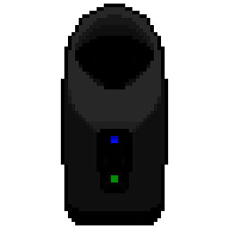
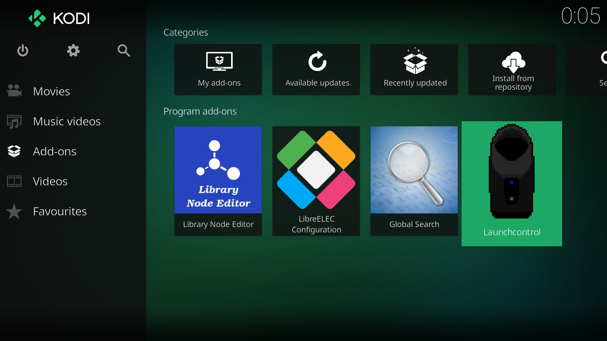
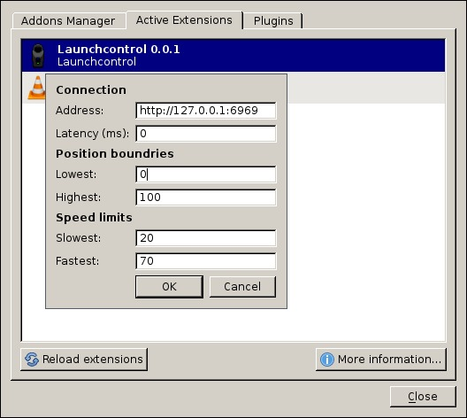
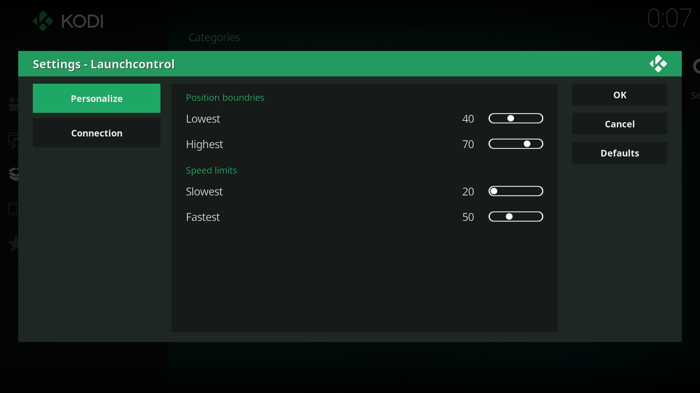

# Launchcontrol (Alpha)

[](https://godoc.org/github.com/funjack/launchcontrol)
[](https://goreportcard.com/report/github.com/funjack/launchcontrol)
[](https://travis-ci.org/funjack/launchcontrol)
[](https://codecov.io/github/funjack/launchcontrol)



Launchcontrol is a server that can control/playback scripts on a Launch. This
project contains plugins for both Kodi and VLC to communicate with the
Launchcontrol server (loading scripts, pausing playback, etc.)

The main platform for Launchcontrol is Linux, but it has been successfully
tested on Mac OS X. Works great on a Raspberry Pi with
[LibreELEC](https://libreelec.tv/) using the Kodi addon.

Windows versions (**experimental!**) require (at time of writing, yet to be
released) [Buttplug](https://buttplug.io/) Websocket server. Check out the
Metafetish [blog](https://www.metafetish.com/) and
[forums](https://metafetish.club/) for the latest status.

The Kodi and VLC addons should work on all platforms (Linux, Mac and Windows.)

Requires a Launch with (at least) firmware 1.2.

## Script formats

Supported haptic script formats:

| Format | Content Type | File extensions |
| ------ | ------------ | --------------- |
| [Funscript](https://godoc.org/github.com/funjack/launchcontrol/protocol/funscript) | `application/prs.funscript+json` | `.funscript` `.json` |
| [Raw](https://godoc.org/github.com/funjack/launchcontrol/protocol/raw) | `application/prs.launchraw+json` | `.launch` `.json` |
| [Kiiroo](https://godoc.org/github.com/funjack/launchcontrol/protocol/kiiroo) | `text/prs.kiiroo` | `.kiiroo` |

Create your own Funscripts using the [Blender addon](https://github.com/funjack/launchcontrol/tree/master/contrib/blender).

## Downloads

Check the [releases](https://github.com/funjack/launchcontrol/releases) page
for the latest binary downloads.

| Filename                           | Description                         |
| ---------------------------------- | ----------------------------------- |
| `launchcontrol_linux_amd64`        | Linux (64-bit)                      |
| `launchcontrol_linux_386`          | Linux (32-bit)                      |
| `launchcontrol_darwin_amd64`       | Mac OS X                            |
| `launchcontrol_linux_arm`          | Linux ARM (Raspberry Pi)            |
| `launchcontrol_windows_amd64`      | Windows (64-bit) **Buttplug only!** |
| `launchcontrol_windows_386`        | Windows (32-bit) **Buttplug only!** |
| `script.service.launchcontrol.zip` | Kodi Addon                          |
| `launchcontrol.lua`                | VLC Extension                       |
| `funscripting.zip`                  | [Blender addon](https://github.com/funjack/launchcontrol/tree/master/contrib/blender) |

## Build

```sh
go get ./...
go build
sudo setcap 'cap_net_raw,cap_net_admin=eip' ./launchcontrol
```

## Usage

### Start using native BLE
```sh
# Start server (listening on localhost:6969 by default)
./launchcontrol
```

### Start using Buttplug Websocket Server (experimental!)
```sh
./launchcontrol -buttplug ws://localhost:12345/buttplug
```

### Execute commands on HTTP endpoint usig cURL
```sh
# Load and play script
curl -XPOST -H "Content-Type: text/prs.kiiroo" --data-ascii \
	"{0.50:1,1.00:4,1.15:0,2.00:2}" http://localhost:6969/v1/play
# Pause a playing script
curl http://localhost:6969/v1/pause
# Resume paused script
curl http://localhost:6969/v1/resume
# Jump to a position in the script
curl http://localhost:6969/v1/skip\?p=1m3s
# Stop and reset script
curl http://localhost:6969/v1/stop
# Start playing last loaded script
curl http://localhost:6969/v1/play
```

## Kodi Integration

The Launchcontrol Kodi service addon connects to a local Launchserver and auto
loads scripts and synchronizes playback, taking into account actions like
pausing and seeking.



Scripts that are paired with the movie file will be loaded. Pairing is done by
placing a script file next a movie using the same base filename (this mirrors
the same convention as for [nfo](http://kodi.wiki/view/NFO_files) or artwork).
The addon uses Kodi's VFS while searching and loading scripts, so even movies
on remote sources like SMB or HTTP servers will work.

**Movie/script pairing example:**

- `/my movies/title.mp4`
- `/my movies/title.kiiroo`

### Install

Download `script.service.launchcontrol.zip` from the
[releases](https://github.com/funjack/launchcontrol/releases) page.  Or package
the plugin yourself from `contrib/kodi/script.service.launchcontrol`. Just zip
up the directory (or use the Makefile.)

This [guide](http://kodi.wiki/view/HOW-TO:Install_add-ons_from_zip_files) shows
how to install the zip file in Kodi. After installation the plugin will
automatically start.

**NOTE:** If you are running Launchcontrol on another machine then Kodi or
are not using the default port, the address can be changed in the add-ons
`configure` menu.

## VLC Integration

VLC extension for Launchcontrol loads script from the local machine into a
Launchcontrol server and plays them in sync with a video. Pairing works the
same as for the Kodi addon, just place the script file next to the video using
the same base filename.



**Note:** The VLC extension has less features then the Kodi addon, see [VLC
Extension README](/contrib/vlc/README.md) for details on what's included.

### Install

Place the [launchcontrol.lua](contrib/vlc/launchcontrol.lua) in VLC's
`lua/extensions/` directory and reload extensions or restart VLC. The extension
must be enabled every time VLC is restarted by clicking `view` `->`
`Launchcontrol`. See [VLC Extension README](/contrib/vlc/README.md) for more
details on the extension.

### Raspberry Pi v2/v3 with LibreELEC

Make sure Bluetooth is **disabled** in the LibreELEC
[Services](https://wiki.libreelec.tv/index.php?title=LibreELEC_Settings#tab=Services)
tab.

Build Launchserver for [arm](https://golang.org/doc/install/source#environment):
```sh
go get ./...
GOARCH=arm GOARM=7 go build
```

Build the script addon:
```sh
make -C contrib/kodi/
```

**Note:** Pre-build binaries are also available on the
[releases](https://github.com/funjack/launchcontrol/releases) page.

Copy the build results and an [autostart.sh](http://wiki.openelec.tv/index.php/Autostart.sh) to the Raspberry Pi:
```sh
ssh root@libreelec 'mkdir /storage/launchcontrol'
scp launchcontrol root@libreelec:/storage/launchcontrol/
scp contrib/kodi/autostart.sh root@libreelec:/storage/.config/
scp contrib/kodi/script.service.launchcontrol.zip root@libreelec:/storage/
```

Reboot LibreELEC and
[install](http://kodi.wiki/view/HOW-TO:Install_add-ons_from_zip_files) the
`script.service.launchcontrol.zip` addon.

Thats it!



## Bluetooth requirements

See the [gatt docs](https://godoc.org/github.com/currantlabs/gatt#hdr-SETUP)
for the Bluetooth requirements/setup.

## Other examples

### Build and run example (Linux)

```sh
go build contrib/examples/playkiiroo.go
sudo setcap 'cap_net_raw,cap_net_admin=eip' ./playkiiroo
./playkiiroo -file input.txt
```

Launchcontrol is released under a [BSD-style license](./LICENSE).
